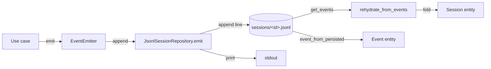
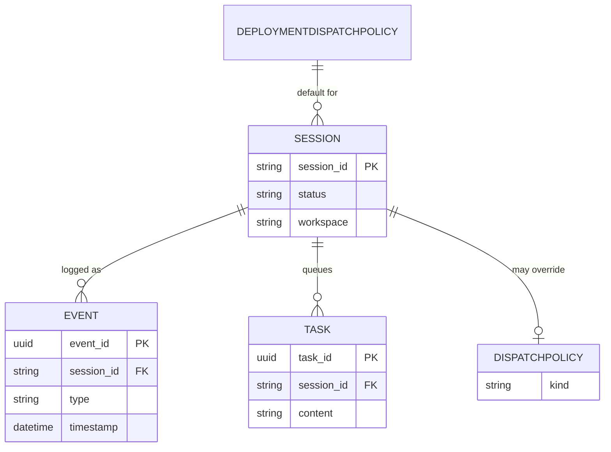

# Data Model

The persistent data model: the entities Mad owns, their key attributes and relationships, and the storage strategy actually used. Mad has no DB — the store is an append-only per-session JSONL event log (hard rule 6). Trace every claim to the domain models and the persistence adapter.

## Storage strategy

Mad has **no database**. The single persistence surface is an **append-only, per-session JSONL event log** on the local filesystem. Each session owns one file, `<session_id>.jsonl`, and every action appends exactly one JSON line to it. The log is the **source of truth** (CLAUDE.md hard rule 6): if the process crashes, a fresh harness rebuilds in-memory state by replaying the log.

There are therefore **no relational tables, no schema migrations, and no ORM**. The "entities" below are in-memory dataclasses; they are never serialized as rows. What is persisted is the *event stream*, and the entities are **projections** rebuilt from that stream.

Two write/read paths exist over this log:

- **Write** — every event is minted and appended by `emit()` in `src/mad/adapters/outbound/persistence/jsonl_session_repository.py`. It prints the line to stdout *and* appends it to the file (hard rule 6: both stdout and the log). At the application layer, `EventEmitter.emit()` is the only caller permitted to write (hard rule 11); use cases never touch the repository directly.
- **Read / rebuild** — `get_events(session_id)` reads the file back as a list of dicts. `rehydrate_from_events(...)` in `src/mad/core/sessions/domain/rehydrate.py` folds that list into a `Session` entity (a pure domain function, no I/O). The `Event` entity is reconstructed line-by-line by `event_from_persisted(...)` in `src/mad/core/events/domain/event.py`.

State that lives **only** in memory (never persisted, rebuilt on demand or lost on restart) is called out per entity below — for example `Session.last_conversation_id` (issue #63, in-memory recovery deferred).



## Entity overview

Mad's `core` is split into three bounded contexts, each with a `domain/` package of framework-free dataclasses (hard rule 4). The entities and value objects that make up the data model:



The relationships are **logical**, reconstructed at runtime — there are no foreign keys on disk. A `Session` *is* its event stream; a `Task`'s lifecycle is a sub-sequence of `task.*` events within that stream; a `Session`'s `dispatch_policy` is rebuilt by replaying `dispatch_policy.updated` / `dispatch_policy.cleared` events (see `rehydrate.py`).

## Session

The primary aggregate root — one agent invocation's lifecycle. Defined in `src/mad/core/sessions/domain/entities/session.py` as a mutable `@dataclass`.

Status transitions: `created -> running -> idle`, `created -> running -> error`, and `any -> deleted`.

| Field | Type | Meaning |
|---|---|---|
| `session_id` | `str` | Aggregate identity. Doubles as the JSONL filename (`<session_id>.jsonl`). |
| `agent` | `dict[str, Any]` | Agent descriptor, e.g. `{"name": ..., "provider": ...}`. Rebuilt from `session.created`. |
| `workspace` | `str` | Absolute path to the session workspace root. |
| `working_directory` | `str` | Effective launcher cwd (ADR-0011); defaults to `workspace` when blank (`__post_init__`). |
| `status` | `str` | Lifecycle state: `created` / `running` / `idle` / `error` / `deleted`. |
| `base_branch` | `str \| None` | Git branch checked out in a cloned-repo mount, if any. |
| `model` | `str \| None` | Per-session model override; `None` means inherit (model precedence resolver). |
| `effort` | `str \| None` | Per-session reasoning-effort override; `None` means inherit. |
| `timeout_s` | `float \| None` | Per-session launcher timeout override (issue #61); `None` inherits the operator default. |
| `resources_mounted` | `list[dict[str, Any]]` | Records of mounted resources (repos, files). |
| `response` | `dict[str, Any]` | Latest agent response payload. |
| `tokens_to_redact` | `list[str]` | Secrets to scrub from output (hard rule 2). `repr=False`; not serialized by `to_dict`. |
| `dispatch_policy` | `DispatchPolicy \| None` | Per-session dispatch override; `None` inherits the deployment default. `repr=False`. |
| `manual_drain_remaining` | `int` | Transient `ManualPolicy` drain budget after `POST /trigger`. `repr=False`. |
| `priority` | `int` | Cross-session dispatch priority `[1, 10]` (issue #46); `DEFAULT_PRIORITY = 1`. |
| `last_conversation_id` | `str \| None` | Last launcher conversation ID. **In-memory only — not persisted to JSONL** (issue #63); the log's `agent.conversation_started` is the authoritative record. |
| `created_at` | `datetime` | UTC creation time (`session.created` timestamp on replay). |
| `updated_at` | `datetime` | UTC time of the latest event; `touch()` only advances it, never rewinds (tolerates out-of-order replay). |

`to_dict` / `from_dict` provide a flat serialization for the in-memory `SessionStore` index (note: `tokens_to_redact`, `dispatch_policy`, `manual_drain_remaining`, and `last_conversation_id` are intentionally omitted from `to_dict`). The authoritative reconstruction path for a session not in the live index is **`rehydrate_from_events`** (`rehydrate.py`), which replays the event stream and rebuilds `agent`, `working_directory`, `model`, `effort`, `timeout_s`, `status`, `dispatch_policy`, `priority`, and the timestamps.

### MountPath (value object)

`src/mad/core/sessions/domain/value_objects/mount_path.py` — a frozen dataclass that wraps a single `value: str`. On construction it enforces hard rule 3 (path-traversal prevention): the path must be absolute and, after resolving `.`/`..` segments, must stay inside `/workspace`, else `PathTraversalError` is raised. It is a guard, not persisted state.

### Sessions domain exceptions

`src/mad/core/sessions/domain/exceptions/base.py`:

| Exception | Raised when |
|---|---|
| `DomainError` | Base class for sessions domain errors. |
| `PathTraversalError` | A `mount_path` would escape the workspace (hard rule 3); carries `mount_path` + `reason`. |
| `SessionNotFound` | A session is absent from both the live index and the JSONL log; carries `session_id`. |

## Event

The unit actually persisted. `src/mad/core/events/domain/event.py`, a frozen `@dataclass`. The events module emits Mad's vocabulary **verbatim** (ADR-0004) — `type` is a free-form string deliberately, so new vocabulary needs no entity change.

| Field | Type | Meaning |
|---|---|---|
| `event_id` | `UUID \| None` | UUIDv7 minted at write time (ADR-0005). `None` for legacy lines written before minting was introduced. |
| `session_id` | `str` | Owning session. **Not stored in the line** — supplied by the reader from the filename. |
| `type` | `str` | Event vocabulary, e.g. `session.created`, `user.message`, `agent.output`, `session.status_idle`, `session.error`, `task.queued`. Free-form. |
| `data` | `dict[str, Any]` | Event-specific payload — every key that is not `event_id`/`type`/`timestamp` in the persisted line. |
| `timestamp` | `datetime` | Mint time; defaults to the Unix epoch for lines lacking a parseable timestamp (so they sort first). |

`event_from_persisted(raw, session_id)` reconstructs an `Event` from a JSONL dict: it parses `event_id`/`timestamp`, defaults the type to `""`, and collects everything outside `_META_KEYS = {event_id, type, timestamp}` into `data`.

### event_id — UUIDv7 (ADR-0005)

Minted by `new_event_id()` in `src/mad/core/events/domain/event_id.py` (RFC 9562 §5.7): 48 bits of Unix milliseconds, version `0b0111`, 12 random bits, RFC-4122 variant, 62 random bits. This makes ids **lexicographically sortable by mint time across files and processes**, which is what powers SSE `Last-Event-ID` catch-up without a parallel store or a global counter. No runtime dependency — it is ~15 lines of stdlib `secrets`/`time`, to be replaced by `uuid.uuid7()` once Python ships it (3.14+). There is **no backfill**: events written before the change carry `event_id: null` and age out as sessions are deleted/rotated.

## On-disk JSONL line shape

Written by `emit()` in `jsonl_session_repository.py`. Each line is a JSON object built as:

```json
{"event_id": "<uuid7>", "type": "<event.type>", "timestamp": "<iso8601-utc>", "<data-key>": "<value>"}
```

The shape rules that matter:

- **`event_id`, `type`, `timestamp` are top-level metadata keys**, always present (modulo legacy null ids). `timestamp` is `datetime.now(UTC).isoformat()`.
- **The event `data` dict is flattened onto the same object** — its keys sit alongside the metadata keys, not nested under a `data` field. `event.update(data)`. So, for example, a `dispatch_priority.updated` event carries `priority` at the top level (see `rehydrate.py::_event_payload`, which strips `type`/`timestamp`/`session_id` to recover the payload).
- **`session_id` is NOT a field in the line** — it is the **filename** (`log_path(session_id) -> sessions/<session_id>.jsonl`). Readers (`event_from_persisted`, `rehydrate_from_events`) inject it from the path.
- Lines are append-only; the file is never rewritten in place. Reading splits on newlines and `json.loads` each non-blank line.

This is why a key collision between a metadata name and a data key would be a bug — the flattening assumes `data` never contains `event_id`/`type`/`timestamp`.

## Task and orchestration entities

The `orchestration` context (`src/mad/core/orchestration/domain/`) governs *how queued work reaches the launcher* (ADR-0009). Its entities are likewise rebuilt from the event stream; per-task **state is not carried on the entity** — it lives in the log as `task.queued -> task.dispatched -> task.{completed,cancelled,failed}`.

### Task

`task.py` — a frozen `@dataclass`. A unit of work submitted via `POST /v1/sessions/{id}/tasks`. `content` is **opaque** (ADR-0009 Decision 7 / hard rule 1) — never inspected by Mad.

| Field | Type | Meaning |
|---|---|---|
| `task_id` | `UUID` | Task identity. |
| `session_id` | `str` | Owning session. |
| `content` | `str` | Opaque prompt/payload handed to the launcher verbatim. |
| `scheduled_for` | `str` | Free-form schedule hint in v1: `"now"`, `"next_window"`, or an ISO-8601 timestamp. |
| `created_at` | `datetime` | Arrival time; the `task.queued` timestamp drives cross-session ordering. |
| `model` | `str \| None` | Per-task model override (highest precedence in the model resolver). |
| `conversation_mode` | `Literal["new", "resume"]` | Whether to start fresh or resume the session's conversation. |

### Dispatch policies (value objects)

`dispatch_policy.py` — the discriminated union `DispatchPolicy = ImmediatePolicy | WorkWindowPolicy | ManualPolicy`, all frozen dataclasses keyed by a `kind` literal.

| Type | `kind` | Behavior |
|---|---|---|
| `ImmediatePolicy` | `immediate` | Default — dispatch as soon as the queue has work. |
| `WorkWindowPolicy` | `work_window` | Dispatch only inside one of its `windows: tuple[Window, ...]`. |
| `ManualPolicy` | `manual` | Queue accumulates; only `POST /trigger` drains it (via `manual_drain_remaining`). |

`Window` (frozen dataclass) is one recurring, possibly midnight-wrapping time range: `start: time`, `end: time`, `timezone: ZoneInfo`, `days: frozenset[Weekday]` (defaults to all seven). `policy_from_dict` / `policy_to_dict` translate the HTTP discriminated-union shape to and from these value objects; malformed input raises `InvalidDispatchPolicy` (a `ValueError -> 422`).

### Ordering

`ordering.py` defines the priority bounds shared by the `Session` entity, the HTTP boundary, and the replay path: `MIN_PRIORITY = 1`, `MAX_PRIORITY = 10`, `DEFAULT_PRIORITY = 1`. `validate_priority` rejects out-of-range or non-int values with `InvalidPriority` (a `ValueError`). Cross-session dispatch order is `(-priority, head_task.created_at, session_id)`.

### Deployment-wide config holders

These are **mutable process-global singletons** (not per-session), each persisted to its own **reserved session log** so it survives restart. They follow one pattern (issue #45 / #55 / #60): a holder dataclass + a precedence resolver. There is no first-class `Workspace` entity — multi-tenancy is deferred (ADR-0006), so "deployment-wide" means one default for the whole instance.

| Holder (file) | Field | Reserved log id | Resolver precedence |
|---|---|---|---|
| `DeploymentDispatchPolicy` (`deployment_policy.py`) | `default: DispatchPolicy \| None` | `__deployment__` | session override > deployment default > `ImmediatePolicy` |
| `DeploymentModelConfig` (`model_config.py`) | `default_model: str \| None` | `__deployment_model__` | task > session > deployment > machine default > `None` |
| `DeploymentEffortConfig` (`effort_config.py`) | `default_effort: str \| None` | `__deployment_effort__` | session > deployment > `None` |

`timeout_config.py` is the parallel knob without a singleton: the operator default lives in the `MAD_AGENT_TIMEOUT_S` env var, and `resolve_effective_timeout` resolves session `timeout_s` > env > `DEFAULT_AGENT_TIMEOUT_S` (600 s). `retry_schedule.py` holds the rate-limit backoff constants (base 30 s, ×2, 1 h per-interval cap, 5 h cumulative ceiling, ±10% jitter) — pure functions, no persisted state.

### Orchestration exceptions

`exceptions/base.py`: `TaskNotFound` (404), `TaskAlreadyDispatched` (409 — no in-flight cancel in v1), `SessionHasInFlightTask` (409 — `/messages` and the dispatcher are mutually exclusive on a session, ADR-0009 Decision 6). `exceptions/rate_limit.py`: `RateLimitError`, raised by a launcher when the agent exits rate-limited; carries `captured_id`, `reason`, and `retry_after_floor_s` to drive the backoff/resume loop (issue #62) — not persisted.

## On-disk paths and layout

### Session logs

Resolved by `sessions_dir()` (`jsonl_session_repository.py`), read from the environment on **every call** so an operator override is honored at runtime:

| Aspect | Value |
|---|---|
| Directory | `MAD_SESSIONS_DIR` if set and non-blank, else `./sessions` (`DEFAULT_SESSIONS_DIR`). |
| Per-session file | `<sessions_dir>/<session_id>.jsonl` (`log_path`). |
| Reserved internal streams | Ids beginning with `__` (e.g. `__deployment__`, `__deployment_model__`, `__deployment_effort__`). Excluded from `list_session_ids` and from purge, so they are never rehydrated or listed as real sessions. |
| Retention | `MAD_SESSIONS_RETENTION_DAYS`: a positive int enables purge of logs whose **last** event predates `now - days`; unset/zero/negative/non-int means keep forever (`resolve_retention_days` -> `None`). `purge_expired_logs` skips `__`-prefixed streams. |

### Workspaces

Resolved by `_workspace_base()` (`local_workspace_provisioner.py`), most specific wins:

| Order | Source |
|---|---|
| 1 | `MAD_WORKSPACE_DIR` (used verbatim; no `~`/`$VAR` expansion; blank treated as unset). |
| 2 | `~/mad` (XDG-friendly default on persistent storage). |
| 3 | `tempfile.gettempdir()` — only if `Path.home()` raises. |

Each session gets `<workspace_base>/mad_<session_id>` (`workspace_path`). Mount paths inside it are resolved by `_resolve_mount`, which strips a leading `/workspace` prefix and joins the remainder under the session workspace. GitHub repos are cloned via `materialize_github_repo`, which strips the token from the remote after clone (hard rule 2) and materializes Claude Code hook artifacts (`.claude/hooks/forward.sh`, `.claude/settings.local.json`) into the cloned repo, registering them in `.git/info/exclude` so they are never committed.

## What is not in the data model

- **No relational database, no schema migrations, no ORM** — the JSONL event log is the entire persistence layer.
- **No `tenant_id`** on any entity or port — multi-tenancy is deferred (ADR-0006); isolation is at the deployment boundary (separate `make serve` / workspace dirs).
- **No persisted `Session.last_conversation_id`** — in-memory recovery across restarts is deferred (issue #63); the log's `agent.conversation_started` is authoritative.
