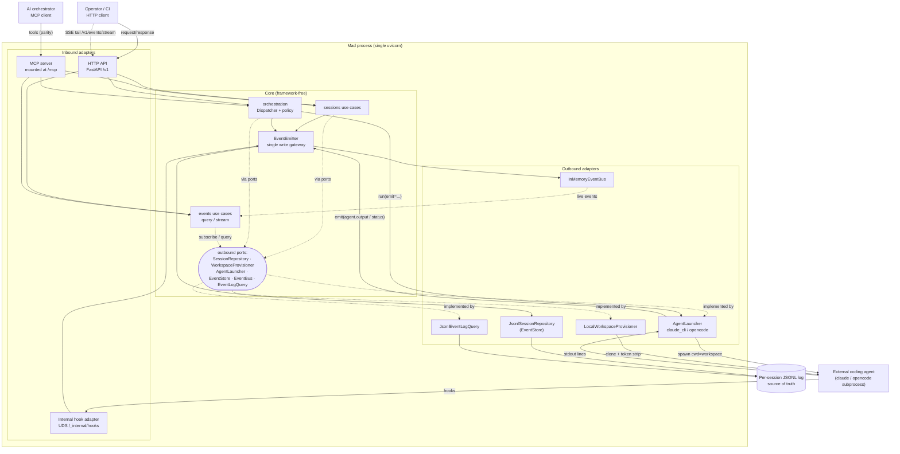

# Architecture Overview

Mad is built as a **hexagonal / ports-and-adapters** application (ADR-0003). The
shape is deliberate: the business logic that decides *what Mad does* lives in a
framework-free centre (`mad.core`), and everything that talks to the outside
world — HTTP, MCP, the filesystem, subprocesses, the event log — lives at the
edges (`mad.adapters`) behind narrow Protocol interfaces ("ports"). Dependencies
point inward only: adapters import core, core never imports adapters. This is
enforced mechanically by `import-linter` and stated as hard rule 4 — `mad.core`
contains no FastAPI, no `subprocess`, and no `mad.adapters` imports.

This document gives the internal narrative and a C4 level-2 (container) view.
For the component-by-component breakdown see [components.md](components.md); for
the persisted shapes see [data-model.md](data-model.md); for the literal file
layout see [source-tree.md](source-tree.md).

## The two halves of the hexagon

### Core — framework-free bounded contexts

`src/mad/core/` is organised **domain-first**: each bounded context owns its own
`domain/`, `ports/`, and `use_cases/` subtree rather than grouping all entities,
ports, and use cases under three global layers (ADR-0003). There are three
contexts:

- **`sessions`** — the lifecycle of an agent session. `domain/` holds the
  `Session` entity, the `MountPath` value object (the path-traversal guard,
  hard rule 3), and the sessions exceptions; `ports/outbound/` declares
  `SessionRepository`, `WorkspaceProvisioner`, and `AgentLauncher`; `use_cases/`
  holds `create_session`, `send_user_message`, `get_session`, `list_sessions`,
  `delete_session`, `auto_sync_prompt`, and `cleanup_sessions`. `store.py` is the
  in-memory live-session index.
- **`events`** — the observability surface (ADR-0004, observability only).
  `domain/` holds `Event` and the UUIDv7 `EventId` (ADR-0005); `ports/` declares
  `EventBus`, `EventStore`, and `EventLogQuery`; `use_cases/` holds
  `query_events` (`GET /v1/events`) and `stream_events` (the SSE tail).
  `emitter.py` is the single write gateway (see below).
- **`orchestration`** — the dispatch/queue policy layer (ADR-0009). It owns task
  ordering, retry/timeout/effort/model policy, the per-deployment dispatch
  policy, and the `Dispatcher` that decides when a queued session is launched.

A `core/shared/` package is intentionally **not** introduced — a "shared" drawer
with no clear owner erodes the bounded-context boundaries (ADR-0003).

### Adapters — the I/O edge

`src/mad/adapters/` implements the ports and drives the outside world:

- **Inbound** (things that call *into* Mad):
  - `inbound/http/` — the public FastAPI app: route modules under `routes/`
    (`sessions`, `events`, `orchestration`, `providers`), `app.py`
    (`create_app`), `dependencies.py` (the composition root), and `asgi.py`
    (a module-level `app = create_app()` for ASGI servers).
  - `inbound/mcp/` — the MCP adapter (ADR-0010, ADR-0012): `build_mcp_server`
    returns a `FastMCP` whose `streamable_http_app()` is mounted at `/mcp`. Its
    tools call the **same use cases** with the **same in-process dependencies**
    and return the **same Pydantic models** as the HTTP routes — HTTP/MCP parity
    is hard rule 13.
  - `inbound/internal/` — a separate FastAPI app bound to a Unix domain socket
    for claude-cli hook ingestion (`POST /_internal/hooks`, ADR-0008). It shares
    the same `EventEmitter`, so hook events appear in the SSE stream
    automatically.
- **Outbound** (things Mad calls *out* to):
  - `outbound/persistence/` — `JsonlSessionRepository` (the append-only per-
    session JSONL log, the source of truth, hard rule 6) and
    `LocalWorkspaceProvisioner` (workspace creation, git clone, token stripping).
  - `outbound/agents/` — the real `AgentLauncher` implementations (`claude_cli`,
    `opencode`), the by-name `factory.get_launcher`, the hook materials
    (`forward.sh`, `settings.local.json`), and the model catalog.
  - `outbound/events/` — `InMemoryEventBus` (the live fan-out) and
    `JsonlEventLogQuery` (reads the log back for query/replay).
  - `outbound/orchestration/` — `InMemoryTaskProjection` and `SystemClock`.

## The composition root

There are no module-level mutable globals (ADR-0003). Every dependency is built
once and injected. `dependencies.py::build_dependencies()` constructs the
production defaults — the store, the JSONL repository, the in-memory bus, the
`EventEmitter`, the task projection, the clock, and the deployment policies —
and `app.py::create_app(...)` wires them into a fresh `FastAPI` instance, exposing
every dependency as a keyword argument so tests can substitute fakes (for
example a `ScriptedLauncher`) without monkey-patching production code. The same
dependency objects are handed to `build_mcp_server(...)`, which is mounted at
`/mcp`; the app lifespan bootstraps the projection and pending sessions from the
log, starts the `Dispatcher`, and runs the MCP session manager.

## The single write gateway

`EventEmitter.emit()` is the **only** sanctioned path that writes the event log
(hard rule 11, ADR-0007). It performs the two-step that used to be duplicated
per use case: persist via `EventStore.append` (satisfied by
`JsonlSessionRepository`), then publish via `EventBus.publish`, then return the
typed `Event`. Use cases receive `EventEmitter` as an injected dependency and
call `emit()`; they MUST NOT call `SessionRepository.append_event` or
`EventBus.publish` directly. Outbound adapters such as the launcher receive an
`emit` callable supplied by the use case; inbound adapters (SSE, query) only
subscribe or query — they never write. Because persist-then-publish is enforced
by structure rather than convention, the JSONL log and the live SSE stream can
never disagree.

## Request flow (HTTP / MCP -> use case -> ports -> outbound)

A synchronous request — for example `POST /v1/sessions` — flows strictly inward
and back out:

1. The inbound adapter (an HTTP route handler, or the mirrored MCP tool)
   validates the request body against a Pydantic model (hard rule 9) and pulls
   the injected dependencies off `app.state`.
2. It constructs the relevant use case (e.g. `CreateSessionUseCase`) with those
   dependencies and `await`s `execute(...)`.
3. The use case runs the business logic against the **ports** — it validates
   every `mount_path` through `MountPath`, calls `WorkspaceProvisioner` to create
   the workspace and clone repos, and calls `EventEmitter.emit("session.created",
   ...)` to record the state change.
4. The ports' concrete **outbound adapters** do the real I/O: the provisioner
   writes the filesystem and strips the GitHub token from the remote (hard rule
   2); the emitter appends to the JSONL log and publishes to the bus.
5. The use case returns a typed result; the adapter maps it to its response
   model. MCP returns the identical model, keeping the two surfaces at parity.

## Agent-output / event flow (launcher stdout -> emit -> log + bus -> SSE)

The asynchronous path is what makes Mad an infrastructure layer rather than an
agent. When a session is launched (by `send_user_message` or by the
`Dispatcher`), the use case calls `AgentLauncher.run(...)` and passes it an
`emit` callback wired to `EventEmitter.emit`:

1. The launcher (e.g. `ClaudeCLIProvider`) spawns the external agent as a
   subprocess with `cwd` set to the resolved working directory (ADR-0011), after
   exporting `MAD_SESSION_ID`, `MAD_HOOK_SOCKET`, and `MAD_PROVIDER`.
2. It reads the subprocess stdout line by line and calls
   `emit("agent.output", {...})` per line. Mad streams the bytes verbatim — it
   NEVER parses tool calls or runs a loop (hard rule 1).
3. On completion it emits `session.status_idle` (exit 0) or `session.error`
   (non-zero / timeout); a transient rate-limit raises `RateLimitError` so the
   dispatcher can retry instead of draining the queue.
4. Each `emit` call persists the event to the per-session JSONL log **and**
   publishes it to the `InMemoryEventBus`.
5. `StreamEventsUseCase` (behind `GET /v1/events/stream`) subscribes to the bus
   and, for reconnecting clients, replays from the log using the `Last-Event-ID`
   UUIDv7 cursor (ADR-0005) before switching to the live tail. The MCP hook
   adapter feeds `agent.<provider>.hook.*` events through the same emitter, so
   they appear on the same stream (ADR-0008).

## Container diagram (C4 level 2)

## Related pages

- [components.md](components.md) — the building blocks inside each container.
- [data-model.md](data-model.md) — the `Session`, `Event`, and log record shapes.
- [source-tree.md](source-tree.md) — the generated file/directory map.
- ADR index: [docs/adr/README.md](../adr/README.md) — the *why* behind these
  structural choices (ADR-0003, ADR-0007, ADR-0010 in particular).
